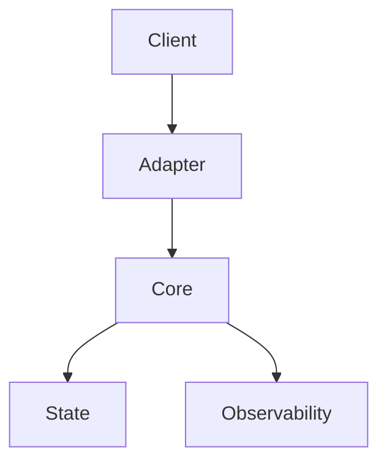

# Rate Limiter Evaluation Framework  
## Technical Design & Delivery Specification (TDDS)

**Version:** 1.0  
**Author:** Marcel Roux  
**Date:** 2026-01-23  
**Status:** Initial Design (Authoritative)

---

## 1. Executive Summary

The **Rate Limiter Evaluation Framework** is a protocol-agnostic system for designing, testing, and empirically evaluating rate-limiting strategies across deployment models and transport protocols.

The project focuses on:
- Modular, swappable rate limiter implementations
- Empirical evaluation rather than purely theoretical comparison
- Support for **REST** and **gRPC** (unary and streaming)
- Measurement of correctness, performance, resilience, and resource usage

This document serves as the **single source of truth** for:
- Design decisions
- Scope boundaries
- Milestones and sub-milestones
- Acceptance criteria

If implemented as specified, this document alone should be sufficient to execute the project end-to-end.

---

## 2. Goals and Non-Goals

### 2.1 Goals

- Provide a **protocol-agnostic rate limiter core**
- Enable **repeatable, empirical evaluation**
- Support:
  - Keyless and keyed rate limiting
  - Burst and sustained limits
  - Single-node and distributed limiters
- Measure:
  - Throughput
  - Latency
  - Resource consumption
  - Failure and recovery behavior
- Serve as a **portfolio-quality systems project**

### 2.2 Non-Goals

- Full API gateway implementation
- Authentication or authorization
- TLS, certificates, or production security hardening
- Production deployment tooling
- Infinite protocol support (only REST and gRPC initially)

---

## 3. System Overview

### 3.1 High-Level Architecture

### 3.2 Key Design Principles

1. **Protocol agnosticism**  
   Limiter logic must not depend on REST or gRPC specifics.

2. **Evaluation-first design**  
   Instrumentation and workload generation are first-class components.

3. **Determinism**  
   Experiments should be reproducible given identical configuration.

4. **Explicit scope control**  
   All supported features must appear in this document.

---

## 4. Design Decisions and Constraints

### 4.1 Core Decisions

| Decision | Rationale |
|--------|-----------|
| Monorepo | Shared abstractions, atomic refactors |
| Rust | Concurrency safety, performance, ecosystem |
| Pluggable limiter interface | Swappable implementations |
| Normalized operation model | Protocol independence |
| Tiered instrumentation | Control overhead |

### 4.2 Constraints

- Single-host execution initially
- No production deployment assumptions
- Evaluation accuracy prioritized over raw throughput

### 4.3 Assumptions

- Instrumentation introduces measurable overhead
- Traffic generator approximates real workloads sufficiently
- Redis is the only external dependency for distributed limiting

---

## 5. High-Level Architecture & Component Layout

| Component / Layer           | Responsibility                                                               | Key Concerns                                                 | Notes / Variants                                       |
| --------------------------- | ---------------------------------------------------------------------------- | ------------------------------------------------------------ | ------------------------------------------------------ |
| **Client Interfaces**       | Originate requests subject to rate limiting                                  | Request volume, key distribution, burstiness                 | REST clients, gRPC clients, streaming producers        |
| **Protocol Adapters**       | Translate protocol-specific requests into a common rate-limit decision model | Protocol semantics, metadata extraction, streaming lifecycle | REST middleware, gRPC interceptors (unary + streaming) |
| **Rate Limiting API**       | Stable, protocol-agnostic interface for rate-limit decisions                 | Low latency, deterministic behavior                          | Drop-in integration point for evaluation               |
| **Rate Limiting Core**      | Implements rate-limiting algorithms                                          | Correctness, fairness, burst handling                        | Token bucket, leaky bucket, fixed/sliding window       |
| **Policy Engine**           | Defines per-key and global limits                                            | Configuration consistency, precedence                        | Keyless, per-key, mixed policies                       |
| **State Abstraction Layer** | Encapsulates storage semantics for counters and buckets                      | Atomicity, contention, durability                            | In-memory, local persistent, distributed               |
| **State Backends**          | Concrete storage implementations                                             | Throughput, consistency, fault tolerance                     | Single-process, Redis-backed, sharded                  |
| **Control Plane**           | Runtime configuration and tuning                                             | Safety, rollout, versioning                                  | Hot-reload, feature gating                             |
| **Observability Layer**     | Instrumentation and telemetry                                                | Overhead, cardinality control                                | Metrics, tracing, structured logs                      |
| **Fault Injection Layer**   | Introduces controlled failures                                               | Realism, isolation                                           | Latency injection, state loss                          |
| **Evaluation Harness**      | Drives synthetic workloads                                                   | Repeatability, determinism                                   | Keyed vs keyless, burst vs sustained                   |
| **Metrics Aggregator**      | Collects and aggregates measurements                                         | Accuracy, low overhead                                       | Latency, throughput, resource usage                    |
| **Reporting & Analysis**    | Produces comparative outputs                                                 | Interpretability                                             | CSV, JSON, plots                                       |
| **Deployment Model**        | Defines runtime topology                                                     | Isolation, scalability                                       | Single-node, multi-node, local-only                    |
| **Security Boundary**       | Protects configuration and state                                             | Abuse resistance                                             | DoS resilience, misuse detection                       |

---

## 6. Milestone-Driven Delivery Plan

### M0 - Development Environment

**Objective:** Establish a consistent and enforceable developer environment for quality, style, and correctness prior to other milestone work.

- **M0.1 - Git Hooks**
  - pre-commit
  - pre-push
  - commit-msg

- **M0.2 - Rust Tooling**
  - `cargo fmt` check formatting
  - `cargo clippy` enforces idiomatic rust
  - `typos` checks spelling

- ** M0.3 - Installation**
  - script to install all git hooks

**Outcome:** All contributors have consistent environment setup for ensuring improved code quality.

### M1 – Core Evaluation Foundation

**Objective:** Establish protocol-agnostic execution and instrumentation.

- **M1.1 – Core Models**
  - Operations
  - Decisions
  - Events

- **M1.2 – Execution Engine**
  - Lifecycle hooks
  - Deterministic execution

- **M1.3 – Instrumentation**
  - Off / Basic / Full tiers
  - Minimal overhead guarantee

**Outcome:** Deterministic, measurable evaluation core.

---

### M2 – Single-Node Enforcement (REST)

**Objective:** Enable practical rate limiting and baseline evaluation.

- **M2.1 – In-Memory Limiters**
- **M2.2 – Hierarchical Limiters**
- **M2.3 – REST Adapter**
- **M2.4 – REST Traffic Generator**

**Outcome:** End-to-end REST rate-limiting experiments.

---

### M3 – Distributed and Resilient Limiting

**Objective:** Model real-world tradeoffs.

- **M3.1 – Redis-Backed Limiters**
- **M3.2 – Hybrid Local + Global**
- **M3.3 – Failure Injection**
- **M3.4 – Distributed Metrics Validation**

**Outcome:** Measured latency, availability, and correctness under failure.

---

### M4 – Protocol Agnosticism (gRPC)

**Objective:** Extend evaluation beyond REST.

- **M4.1 – Unary gRPC**
- **M4.2 – Server-Side Streaming**
- **M4.3 – Client & Bi-Directional Streaming**
- **M4.4 – gRPC Traffic Generator**

**Outcome:** Uniform enforcement across unary and streaming RPCs.

---

### M5 – Usability and Validation

**Objective:** Execution and reporting.

- **M5.1 – CLI**
- **M5.2 – Reporting**
- **M5.3 – Baseline Experiments**

**Outcome:** One-command, reproducible experiments.

---

## 7. Instrumentation and Measurement

- Metrics:
  - Latency (p50/p95/p99)
  - Throughput
  - Denials
  - Resource usage
- Instrumentation tiers:
  - Off
  - Basic
  - Full

Instrumentation must be explicitly enabled and bounded.

---

## 8. Risks and Mitigations

| Risk | Mitigation |
|----|-----------|
| Over-instrumentation | Tiered metrics |
| Streaming complexity | Per-message enforcement |
| Redis latency dominance | Hybrid limiter |
| Scope creep | TDDS as authority |

---

## 9. Validation Strategy

- Deterministic experiment configs
- Side-by-side limiter comparison
- Explicit failure scenarios
- Structured result artifacts

---

## 10. Document Status

This TDDS is the **authoritative design reference**.  
All scope changes must be reflected here.
